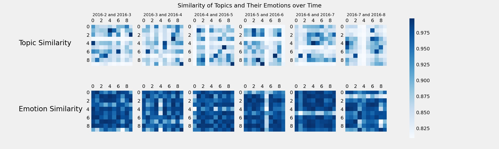

# Topic and emotion evolution in news

Trending topics in news change from time to time. Do the emotions associated with these topics change as well? In this project, we proposed novel characterisations and measures for the evolution of topics and emotions in news based on Dirichlet Latent Allocation model. As for experimental contribution, we conducted topic modelling and sentiment analysis on a dataset consisting of 150,000 news article from 15 American publications using the PyData stack (numpy, pandas, and matplotlib) and scikit-learn.

This repository includes:
1. clean.py: data cleaning, including link deletion, non-alphabetical and non-space character deletion, lemmatisation
2. explore.py: exploratory data analysis and visualisation of (a) distribution of publications, (b), monthly article counts, and (c) topics of a chosen month
3. save_topics.py: topic modelling: saving the topics of a given month into a json file
4. visualise.py: plotting cosine similarity matrices from data files
