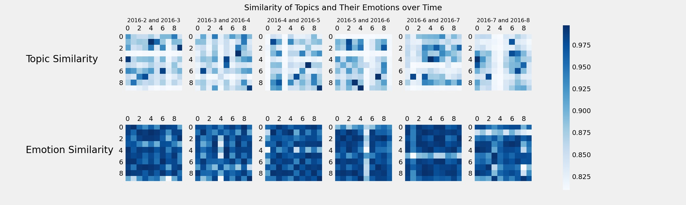
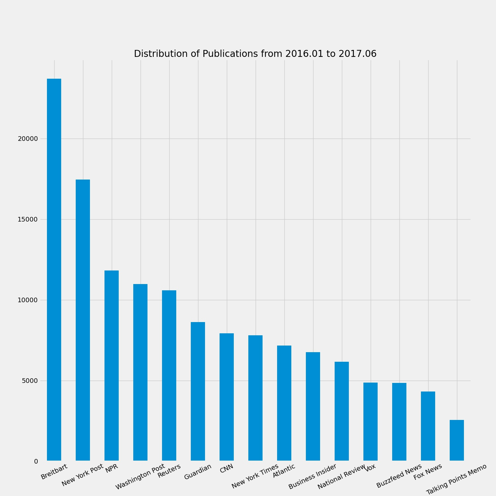
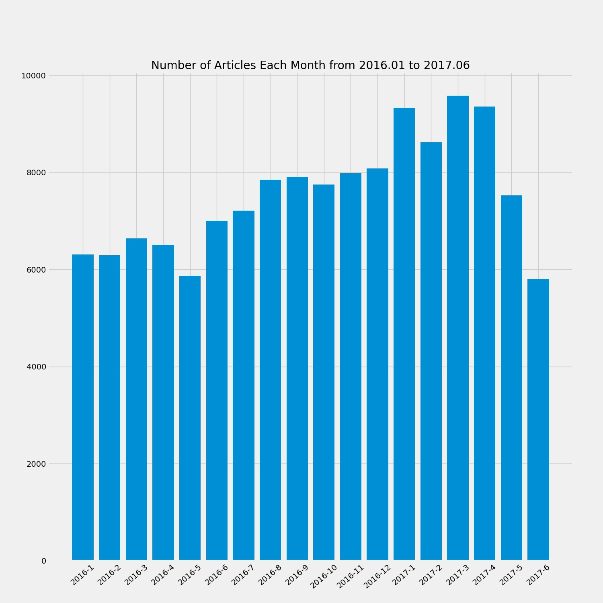
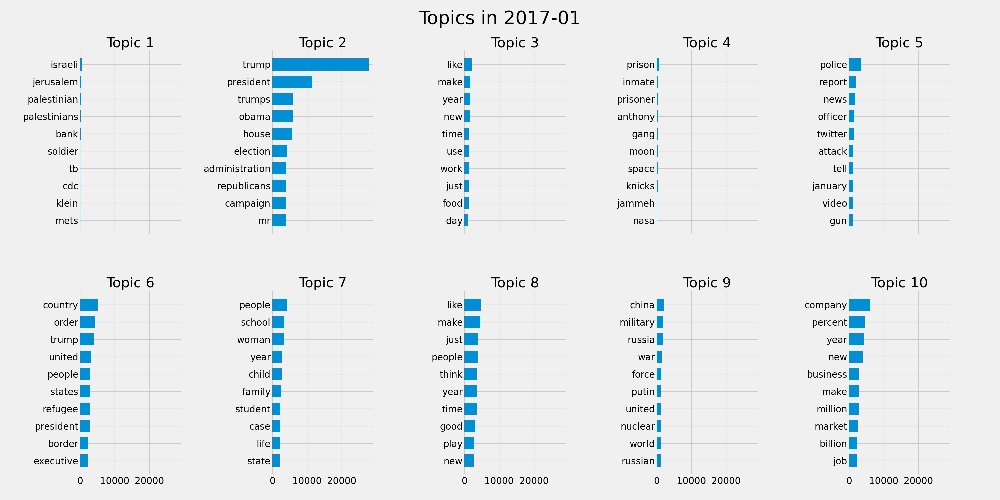
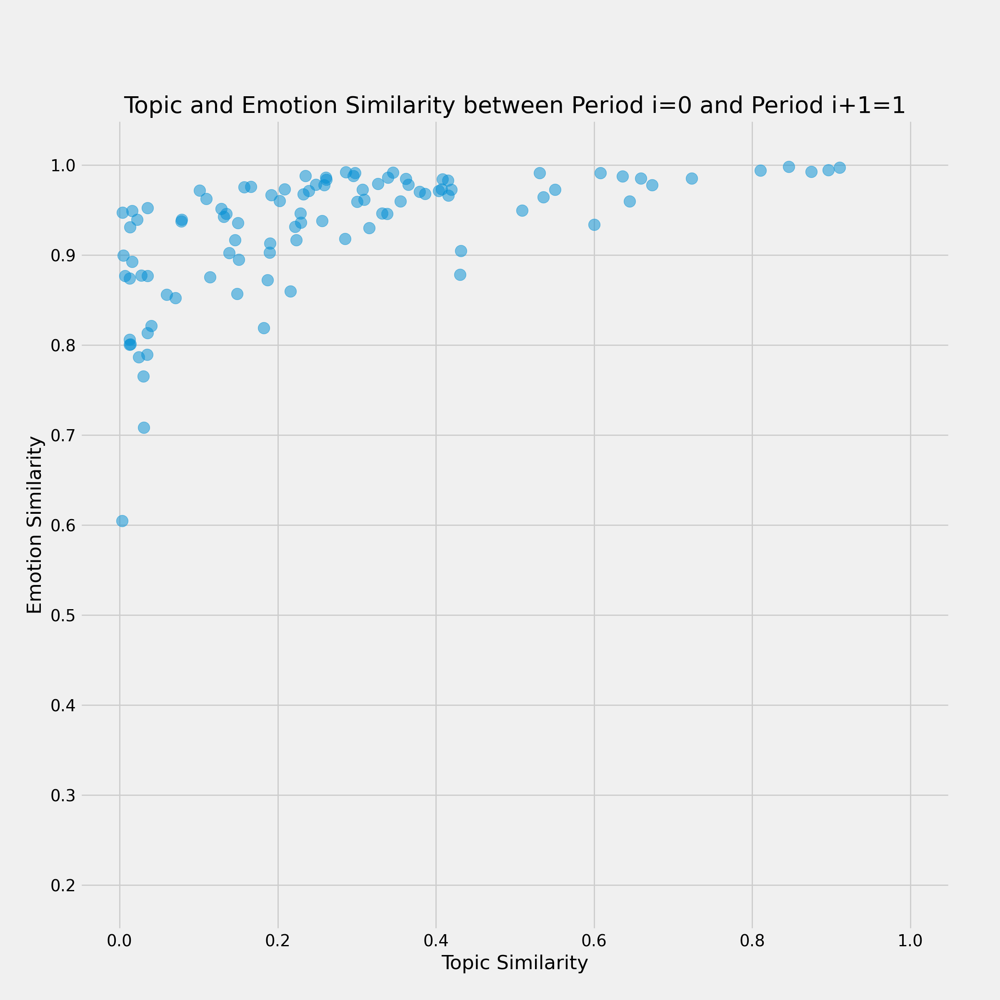
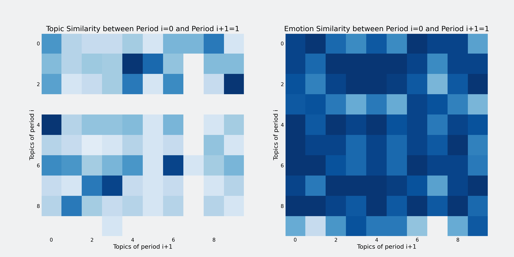

# Topic and emotion evolution in news



Trending topics in news change from time to time. Do the emotions associated with these topics change as well? In this project, we proposed novel characterisations and measures for the evolution of topics and emotions in news based on Dirichlet Latent Allocation model. As for experimental contribution, we conducted topic modelling and sentiment analysis on a dataset consisting of 150,000 news article from 15 American publications.

This project is submitted as part of the final project of HSS302 Computational Social Science at KAIST, 
offered in Fall 2021. The report is available [here](https://ngqm.github.io/blog/css-paper.pdf). This 
repository includes our source code and documentation to reproduce our results.

## Prerequisite

To run our source code, you will need to install
- the PyData stack (numpy, pandas, and matplotlib)
- scikit-learn
- spacy

## Reproduce our results

You can reproduce our results through the following steps:

### Download the data 

We make use of the *All the news* dataset from Kaggle [1], which consists of 150,000 news articles from 15 American publications. 
The dataset can be downloaded from [here](https://www.kaggle.com/snapcrack/all-the-news).

After downloading, organise the data into a `data` directory as follows:
```
data/
- articles1.csv
- articles2.csv
- articles3.csv
```

### Clean the data

To clean the article data from month `MONTH` year `YEAR`,
run the following command:
```
python clean.py MONTH YEAR
```
It will generate a csv file named `data-{YEAR}-{MONTH}.csv`
where links and non-alphabetical and non-space characters have 
been deleted. Lemmatisation is also performed.

### Perform exploratory data analysis

For exploratory data analysis, run the following command:
```
python explore.py
```
It will plot
- The distribution of the data over news outlets in `publication-distribution.jpg`
- The number of articles per month in the data in `article-counts.jpg`
- Results of topic modeling with Latent Dirichlet Allocation in `topics.jpg`

The figures should look like





### Perform topic modeling and sentiment analysis

Save the topics of a given month with the following command:
```
python save_topics.py
```
where the month is specified as a constant in `save_topic.py`, line 18.
The command saves the topic modeling results inside a 
json file named `topics/topics-{MONTH}.json` and the sentiment analysis
results inside a json file named `emotions/emotions-{MONTH}.json`.

### Visualise the evolution of topics and emotions

One main contribution of our project is the visualisation of how
topics and emotions evolve in time, which can be produced using
```
python visualise.py topic_emotion
```
The figure should look like


## More visualisations

We also provide animated visualisations, which can be produced using 
the following commands
```
python visualise.py scatter_animation
python visualise.py matrix_animation
```

The result should look like



## References 

[1] Thompson A. (2017, August). *All the news*. Retrieved April 25, 2023 from 
https://www.kaggle.com/snapcrack/all-the-news.
